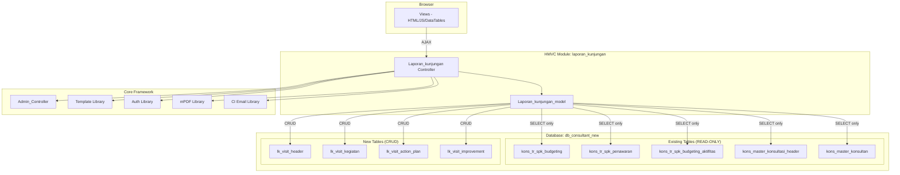

# Design Document: Laporan Kunjungan Konsultan

## Overview

Modul Laporan Kunjungan Konsultan adalah modul HMVC baru yang sepenuhnya terisolasi di dalam `application/modules/laporan_kunjungan/`. Modul ini memungkinkan konsultan mencatat laporan kunjungan ke client, melacak kegiatan konsultasi, action plan, dan potensi improvement. Modul mengakses data SPK yang sudah ada (read-only) dari database `db_consultant_new` (konstanta `DBCNL`) dan menyimpan data baru di tabel-tabel khusus dengan prefix `lk_` (laporan kunjungan).

### Design Decisions

1. **Nama modul**: `laporan_kunjungan` — mengikuti konvensi snake_case yang digunakan modul lain (kasbon_project, master_konsultan, dll).
2. **Database**: Menggunakan database `db_consultant_new` yang sama (via konstanta `DBCNL`) karena data SPK sudah ada di sana. Tabel baru menggunakan prefix `lk_` untuk isolasi.
3. **Pola controller**: Extends `Admin_Controller`, menggunakan permission properties, dan DataTables server-side processing via AJAX — sama persis dengan `kasbon_project`.
4. **PDF generation**: Menggunakan mPDF 5.7.4 yang sudah tersedia di `application/libraries/Mpdf.php`.
5. **Waktu server**: Start/Finish time direkam di server-side (PHP `date()`) untuk akurasi, bukan client-side JavaScript.
6. **Mandays calculation**: 1 manday = 8 jam. Durasi dihitung dari selisih start-finish time, dibagi 8, dibulatkan 2 desimal.

## Architecture



### Module Directory Structure

```
application/modules/laporan_kunjungan/
├── controllers/
│   └── Laporan_kunjungan.php
├── models/
│   └── Laporan_kunjungan_model.php
└── views/
    ├── index.php              (daftar project SPK)
    ├── view.php               (detail project read-only)
    ├── visit.php              (form kunjungan - start/finish/kegiatan/action plan)
    ├── edit.php               (edit draft report)
    ├── report.php             (kumulatif laporan kunjungan)
    └── pdf_report.php         (template HTML untuk PDF generation)
```

## Components and Interfaces

### Controller: `Laporan_kunjungan`

```php
class Laporan_kunjungan extends Admin_Controller
{
    protected $viewPermission   = 'Laporan_Kunjungan.View';
    protected $addPermission    = 'Laporan_Kunjungan.Add';
    protected $managePermission = 'Laporan_Kunjungan.Manage';
    protected $deletePermission = 'Laporan_Kunjungan.Delete';
}
```

**Public Methods:**

| Method | Permission | Description |
|--------|-----------|-------------|
| `index()` | View | Menampilkan halaman daftar project SPK |
| `get_data_spk()` | View | AJAX endpoint untuk DataTables server-side |
| `view($id_spk)` | View | Detail project SPK (read-only) |
| `visit($id_spk)` | Add | Form kunjungan baru |
| `start_session()` | Add | AJAX: Rekam waktu mulai |
| `finish_session()` | Add | AJAX: Rekam waktu selesai |
| `get_kegiatan($id_spk)` | View | AJAX: Ambil daftar kegiatan SPK |
| `save_draft()` | Add | AJAX: Simpan sebagai draft |
| `save_final()` | Add | AJAX: Simpan sebagai final |
| `edit($id_visit)` | Manage | Edit draft report |
| `update_draft()` | Manage | AJAX: Update draft |
| `update_final()` | Manage | AJAX: Finalisasi draft |
| `report($id_spk)` | View | Halaman kumulatif report |
| `get_report_data($id_spk)` | View | AJAX: Data kumulatif report |
| `update_action_plan_status()` | Manage | AJAX: Update status action plan |
| `download_pdf($id_spk)` | View | Generate & download PDF |
| `send_email($id_spk)` | Manage | Kirim PDF via email |

### Model: `Laporan_kunjungan_model`

```php
class Laporan_kunjungan_model extends BF_Model
{
    protected $table_name = 'lk_visit_header';
    protected $key = 'id';
}
```

**Public Methods:**

| Method | Description |
|--------|-------------|
| `get_spk_list($konsultan_id)` | SELECT SPK projects assigned to konsultan |
| `get_spk_detail($id_spk)` | SELECT detail SPK with joins |
| `get_kegiatan_spk($id_spk)` | SELECT kegiatan from SPK aktifitas |
| `get_mandays_allocated($id_spk)` | SELECT total mandays from SPK |
| `get_mandays_used($id_spk)` | SUM mandays from all visits for project |
| `create_visit($data)` | INSERT new visit header |
| `update_visit($id, $data)` | UPDATE visit header |
| `save_kegiatan($visit_id, $kegiatan_data)` | INSERT/UPDATE kegiatan entries |
| `save_action_plans($kegiatan_id, $plans)` | INSERT/UPDATE action plans |
| `save_improvement($visit_id, $data)` | INSERT/UPDATE improvement data |
| `get_visit($id)` | SELECT visit with all related data |
| `get_visits_by_project($id_spk)` | SELECT all final visits for project |
| `get_previous_action_plans($id_spk)` | SELECT action plans from previous visits |
| `update_action_plan_status($id, $status)` | UPDATE action plan status |
| `get_client_email($id_spk)` | SELECT client email from SPK data |

## Data Models

### New Tables (prefix `lk_`)

#### `lk_visit_header`

| Column | Type | Constraints | Description |
|--------|------|-------------|-------------|
| id | INT(11) | PK, AUTO_INCREMENT | Primary key |
| id_spk_budgeting | VARCHAR(50) | NOT NULL, INDEX | FK ke kons_tr_spk_budgeting |
| konsultan_id | VARCHAR(50) | NOT NULL | ID konsultan (dari session user) |
| konsultan_name | VARCHAR(100) | NOT NULL | Nama konsultan |
| visit_date | DATE | NOT NULL | Tanggal kunjungan |
| start_time | TIME | NULL | Waktu mulai (HH:mm:ss) |
| finish_time | TIME | NULL | Waktu selesai (HH:mm:ss) |
| duration_minutes | INT | NULL | Durasi dalam menit |
| mandays_used | DECIMAL(5,2) | NULL | Mandays terpakai (durasi/8) |
| potensi_improvement | TEXT | NULL | Max 2000 chars |
| hasil_improvement | TEXT | NULL | Max 2000 chars |
| status | ENUM('draft','final') | DEFAULT 'draft' | Status laporan |
| created_at | DATETIME | NOT NULL | Timestamp pembuatan |
| updated_at | DATETIME | NULL | Timestamp update terakhir |
| created_by | VARCHAR(50) | NULL | User yang membuat |

#### `lk_visit_kegiatan`

| Column | Type | Constraints | Description |
|--------|------|-------------|-------------|
| id | INT(11) | PK, AUTO_INCREMENT | Primary key |
| visit_id | INT(11) | NOT NULL, FK | FK ke lk_visit_header.id |
| id_aktifitas | VARCHAR(50) | NULL | FK ke SPK aktifitas (NULL jika custom) |
| nama_kegiatan | VARCHAR(500) | NOT NULL | Nama kegiatan (dari SPK atau custom) |
| is_custom | TINYINT(1) | DEFAULT 0 | 1 jika kegiatan custom |
| sort_order | INT | DEFAULT 0 | Urutan tampilan |

#### `lk_visit_action_plan`

| Column | Type | Constraints | Description |
|--------|------|-------------|-------------|
| id | INT(11) | PK, AUTO_INCREMENT | Primary key |
| kegiatan_id | INT(11) | NOT NULL, FK | FK ke lk_visit_kegiatan.id |
| visit_id | INT(11) | NOT NULL, FK | FK ke lk_visit_header.id |
| description | VARCHAR(500) | NOT NULL | Deskripsi action plan |
| pic | VARCHAR(100) | NOT NULL | Person in charge |
| due_date | DATE | NOT NULL | Tanggal target |
| status | ENUM('Progress','Done') | DEFAULT 'Progress' | Status action plan |
| created_at | DATETIME | NOT NULL | Timestamp pembuatan |
| updated_at | DATETIME | NULL | Timestamp update |

#### `lk_visit_improvement` (optional, bisa digabung ke header)

Potensi dan Hasil Improvement disimpan langsung di `lk_visit_header` sebagai kolom `potensi_improvement` dan `hasil_improvement` (TEXT) karena relasinya 1:1 dengan visit.

### Existing Tables (READ-ONLY access)

| Table | Key Fields Used |
|-------|----------------|
| `kons_tr_spk_budgeting` | id_spk_budgeting, id_spk_penawaran, nm_customer, nm_project_leader, nm_project, id_project, sts |
| `kons_tr_spk_penawaran` | id_spk_penawaran, nm_sales, waktu_from, waktu_to |
| `kons_tr_spk_budgeting_aktifitas` | id_spk_budgeting, id_aktifitas, nm_aktifitas, mandays_subcont_final |
| `kons_master_konsultasi_header` | id_konsultasi_h, nm_paket |
| `kons_master_konsultan` | id_konsultan, nama_konsultan |

### Mandays Calculation Logic

```
duration_minutes = finish_time - start_time (in minutes)
duration_hours = duration_minutes / 60
mandays_used = ROUND(duration_hours / 8, 2)
cumulative_mandays = SUM(mandays_used) for all visits of same project
sisa_mandays = mandays_allocated - cumulative_mandays
```

### Permission Entries

Exactly 4 permissions following existing pattern:
- `Laporan_Kunjungan.View`
- `Laporan_Kunjungan.Add`
- `Laporan_Kunjungan.Manage`
- `Laporan_Kunjungan.Delete`

## Correctness Properties

*A property is a characteristic or behavior that should hold true across all valid executions of a system — essentially, a formal statement about what the system should do. Properties serve as the bridge between human-readable specifications and machine-verifiable correctness guarantees.*

### Property 1: Mandays calculation consistency

*For any* visit session with a valid start time and finish time where finish > start, the calculated `mandays_used` SHALL equal `ROUND((finish_time - start_time) / 60 / 8, 2)` — the duration in hours divided by 8, rounded to 2 decimal places.

**Validates: Requirements 7.3, 9.2**

### Property 2: Cumulative mandays is sum of individual visits

*For any* project with one or more finalized visit reports, the displayed cumulative `Mandays_Terpakai` SHALL equal the sum of `mandays_used` from all visit sessions for that project, and `Sisa_Mandays` SHALL equal `mandays_allocated - cumulative_mandays_terpakai`.

**Validates: Requirements 9.2, 9.3**

### Property 3: Whitespace-only kegiatan rejection

*For any* string composed entirely of whitespace characters (spaces, tabs, newlines), attempting to add it as a custom Kegiatan SHALL be rejected and the kegiatan list SHALL remain unchanged.

**Validates: Requirements 3.7**

### Property 4: Action plan due date validation

*For any* action plan entry, if the due date is earlier than the current visit date, the system SHALL reject the entry and display a validation error.

**Validates: Requirements 4.7**

### Property 5: Draft save preserves all data round-trip

*For any* visit report data (kegiatan, action plans, improvement text, times), saving as draft and then loading the draft SHALL return all the same data that was saved, including empty optional fields.

**Validates: Requirements 8.1, 6.5, 6.7**

### Property 6: Final save validation completeness

*For any* visit report, attempting to save as "Final" SHALL succeed if and only if all required fields (at least one Kegiatan, at least one Action_Plan per Kegiatan with description/PIC/due_date, start_time, finish_time where start < finish) are non-empty and valid.

**Validates: Requirements 8.3, 8.4, 8.5**

### Property 7: Final status prevents editing

*For any* visit report with "Final" status, all edit operations SHALL be rejected and the report content SHALL remain unchanged.

**Validates: Requirements 8.6**

### Property 8: SPK data isolation (read-only access)

*For any* operation performed by the module, the state of existing SPK tables (kons_tr_spk_budgeting, kons_tr_spk_penawaran, kons_tr_spk_budgeting_aktifitas, kons_master_konsultasi_header) SHALL remain unchanged before and after the operation.

**Validates: Requirements 12.2**

### Property 9: Character limit enforcement

*For any* input string exceeding 2000 characters in Potensi_Improvement or Hasil_Improvement fields, the system SHALL reject the submission and the stored value SHALL remain unchanged.

**Validates: Requirements 6.6**

### Property 10: Action plan status toggle persistence

*For any* action plan entry, updating its status from "Progress" to "Done" or from "Done" to "Progress" SHALL persist the change so that subsequent visits reflect the updated status.

**Validates: Requirements 5.3, 5.4**

## Error Handling

### Server-Side Errors

| Scenario | Handling |
|----------|----------|
| Database connection failure | Display generic error message, log error, retain form data |
| Start/Finish time recording failure | Return JSON error response, keep button enabled for retry |
| Save operation failure | Return JSON error with message, retain all form data, keep previous status |
| PDF generation failure | Display error message, allow retry |
| Email sending failure | Display error message with retry option |
| SPK data not found | Display "data not available" message, show 0 for mandays |
| Permission denied | Redirect to dashboard with access denied message |

### Client-Side Validation

| Field | Validation |
|-------|-----------|
| Custom Kegiatan | Non-empty, max 500 chars, trim whitespace |
| Action Plan description | Non-empty, max 500 chars |
| PIC | Non-empty, max 100 chars |
| Due Date | Valid date, >= visit date |
| Potensi Improvement | Max 2000 chars |
| Hasil Improvement | Max 2000 chars |
| Start/Finish | Finish must be after Start |

### Transaction Safety

All save operations use `$this->db->trans_begin()` / `$this->db->trans_commit()` / `$this->db->trans_rollback()` pattern to ensure atomicity when saving header + kegiatan + action plans together.

## Testing Strategy

### Unit Tests (Example-Based)

- Verify permission checks block unauthorized access
- Verify SPK list only shows projects for logged-in konsultan
- Verify draft can be edited, final cannot
- Verify PDF contains correct report structure
- Verify email is sent to correct address
- Verify empty state messages display correctly

### Integration Tests

- Full flow: create visit → start → add kegiatan → add action plan → finish → save draft → edit → save final
- Verify DataTables server-side processing returns correct data
- Verify cross-database queries (DBCNL) work correctly
- Verify mPDF generates valid PDF output

### Property-Based Tests

Property-based testing is applicable for the pure logic functions in this module:

- **Library**: Use a PHP PBT library (e.g., Eris or PhpQuickCheck)
- **Minimum iterations**: 100 per property
- **Tag format**: `Feature: laporan-kunjungan-konsultan, Property {N}: {description}`

**Target functions for PBT:**
1. Mandays calculation function (Property 1)
2. Cumulative mandays aggregation (Property 2)
3. Input validation functions — whitespace rejection (Property 3), date validation (Property 4), character limits (Property 9)
4. Save/load round-trip for draft data (Property 5)
5. Final validation logic (Property 6)

### Manual Testing

- UI/UX flow verification
- Cross-browser DataTables rendering
- PDF layout and formatting review
- Email delivery and content verification
- Permission matrix verification across user roles
