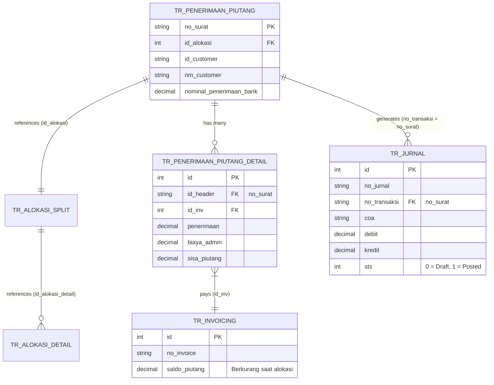
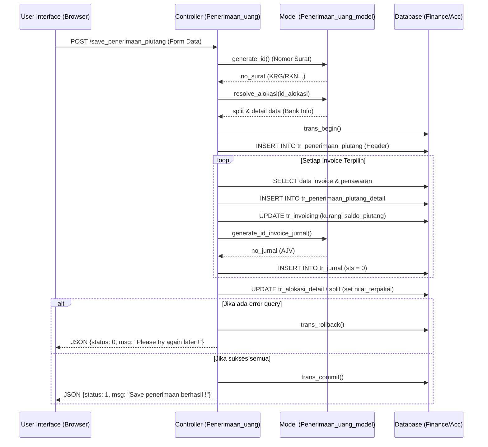
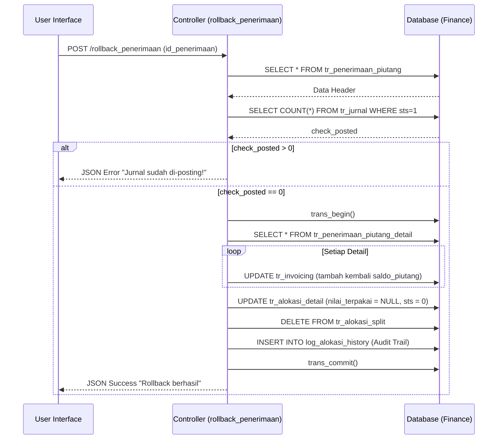

# System Design Document: Modul Penerimaan Uang (Penerimaan Piutang)

## 1. Pendahuluan
Dokumen ini menguraikan arsitektur sistem, desain antarmuka (UI/UX), spesifikasi basis data, dan diagram urutan (*Sequence Diagram*) untuk modul **Penerimaan Uang**. Dokumen ini difokuskan pada "bagaimana" modul ini dibangun secara teknis, melengkapi dokumen PRD (*Product Requirements Document*) yang berfokus pada alur bisnis.

---

## 2. Desain Antarmuka Pengguna (UI/UX)
Sistem menggunakan *stack* standar berupa Bootstrap, jQuery, dan DataTables.

### 2.1. Halaman Utama (Dashboard Alokasi)
Halaman ini (`views/index.php`) berfungsi sebagai pusat pemantauan dana masuk yang belum / sudah di-*follow-up*.
- **Filter Bar:** Terdapat *dropdown* filter "Bank" untuk menyaring mutasi berdasarkan bank penerima.
- **DataTables Server-Side:** Menampilkan daftar dana masuk secara asinkron (AJAX ke `get_alokasi_penerimaan()`).
- **Komponen UI Kolom Status:**
  - Dana Belum Diproses: Menggunakan komponen `Draft`.
  - Dana Sudah Diproses: Menggunakan komponen `Used`.
- **Komponen UI Kolom Action:**
  - Jika Draft: Tombol biru (`btn-primary`) dengan ikon `<i class="fa fa-plus"></i>` untuk melakukan Alokasi.
  - Jika Used: Tombol detail (`btn-info`) dengan ikon mata `<i class="fa fa-eye"></i>`, dan tombol *Rollback* (`btn-danger`) dengan ikon *undo* `<i class="fa fa-undo"></i>` jika jurnal belum di-*posting*.

### 2.2. Form Alokasi & Pelunasan Invoice
Halaman form (`views/add.php` dan `views/process.php`) mengandalkan tabel interaktif untuk *data entry*.
- **Pemilihan Customer:** Dropdown *Select2* (atau *combo box*) untuk mencari customer. Saat diubah (`onchange`), sistem memicu AJAX `get_inv_by_cust()`.
- **Daftar Invoice:** Ditampilkan dalam format tabel. Invoice *Non-Konsultasi* diberi label khusus `Non Kons`.
- **Input Kalkulasi Dinamis:**
  Terdapat *text input* berformat angka (menggunakan library `autonum` / *auto-numeric*). Setiap input (`penerimaan`, `biaya_admin`) memicu *event* `onkeyup="hitungAll()"` di JavaScript untuk memvalidasi secara *real-time* saldo akhir dan kontrol selisih (Zero Balance Check).
- **Validasi Submit:** Tombol "Save" akan di-*disable* atau memunculkan peringatan (via *SweetAlert*) apabila field **Kontrol (Selisih)** tidak bernilai `0`.

---

## 3. Arsitektur Basis Data (Entity Relationship)

Berikut adalah desain *Schema* dan Relasi Data yang menggerakkan modul ini.

---

## 4. Sequence Diagram: Proses Simpan Alokasi (Save)

Diagram ini mengilustrasikan alur sistem saat User Finance melakukan *Submit* form alokasi penerimaan piutang.

---

## 5. Sequence Diagram: Fitur Rollback

Alur pembatalan transaksi penerimaan uang. Mengutamakan integritas jurnal akuntansi.

---
*Dokumen desain ini menggambarkan kondisi implementasi kodingan saat ini. Semua perubahan struktur database atau flow validasi diwajibkan untuk disinkronisasi kembali ke dokumen ini.*
